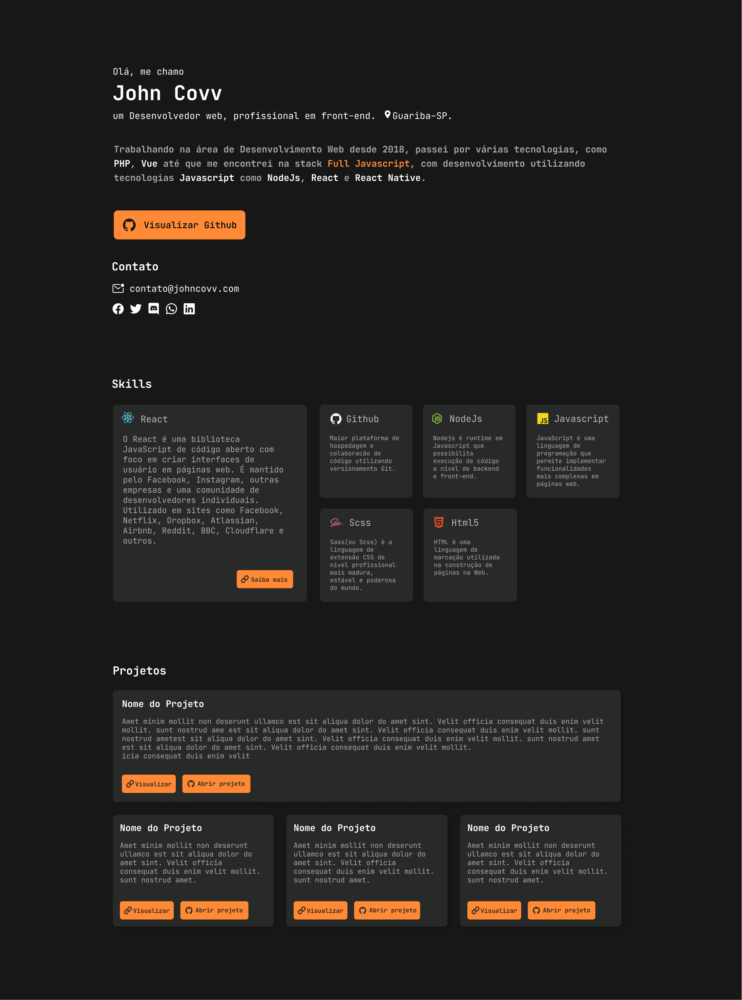

# Personal portfolio 2020

The portfolio, although simple, is being made in ReactJs to be easy to implement new features such as demo of private projects.

Technologies used:

1. [typescript](https://github.com/microsoft/TypeScript)
2. [ReactJs](https://github.com/facebook/react)
3. [StyledComponents](https://github.com/styled-components/styled-components)

 
 

🔗 [figma ui design](https://www.figma.com/file/ye5EZZmb9yJq9DshE9BgK9/Profile?node-id=1%3A2)

	

