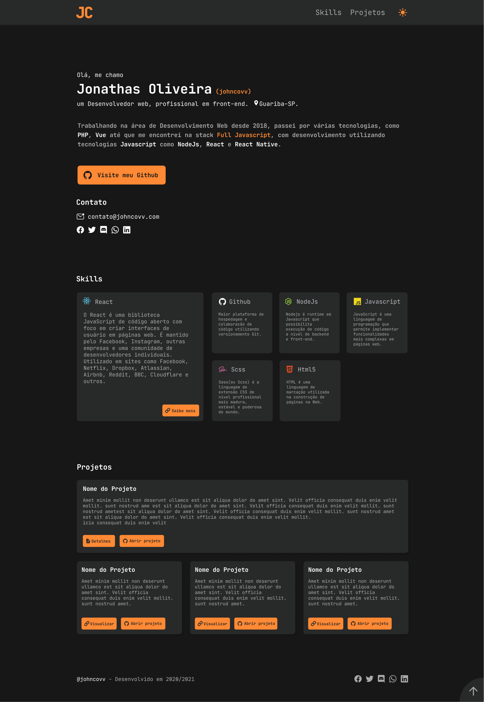
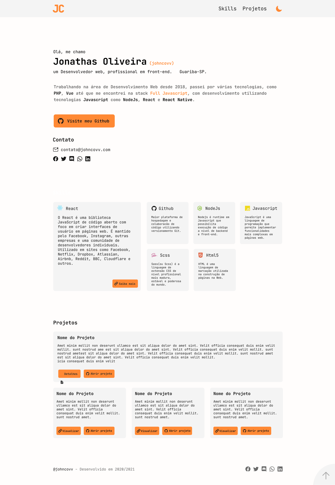
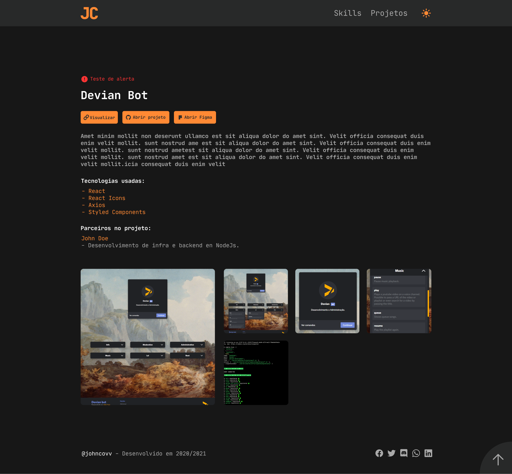
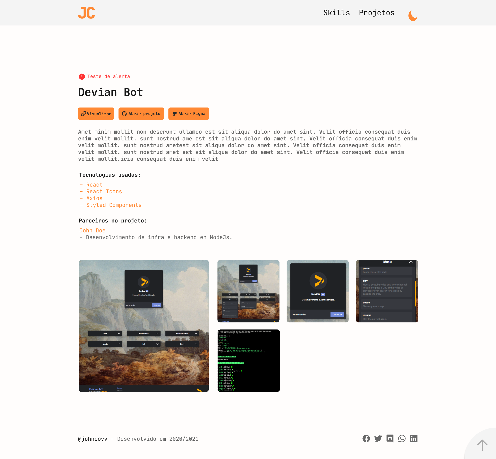
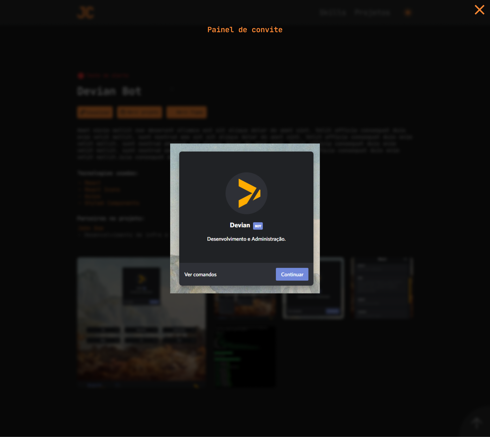
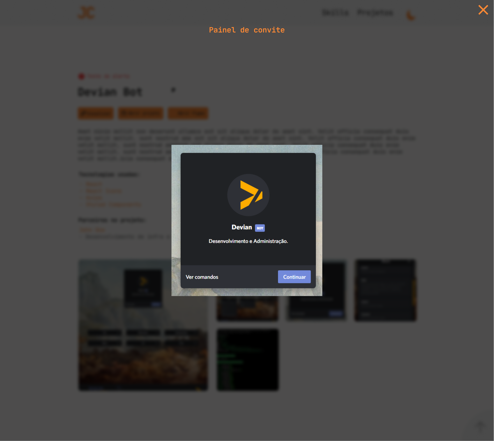

# Personal portfolio 2020

🔗 [Open Portfolio](https://johncovv.com)

The portfolio, although simple, is being made in ReactJs to be easy to implement new features such as demo of private projects.

Design preview:

- 🖼 [Image ***Dark*** Theme](#dark-theme)
- 🖼 [Image ***Light*** Theme](#light-theme)
- 🔗 [Figma UI Design](https://www.figma.com/file/ye5EZZmb9yJq9DshE9BgK9/Profile?node-id=1%3A2)

 
 
Technologies used:

1. [Typescript](https://github.com/microsoft/TypeScript)
2. [ReactJs](https://github.com/facebook/react)
3. [Styled Components](https://github.com/styled-components/styled-components)
4. [React Icons](https://github.com/react-icons/react-icons)

 
 

# Preview

Home Dark Theme             | Home Light theme
:-------------------------:|:-------------------------:
  |  
Project Dark Theme  |  Project Light Theme
  |  
Project (image open) Dark Theme  |  Project (image open) Light Theme
  |  
